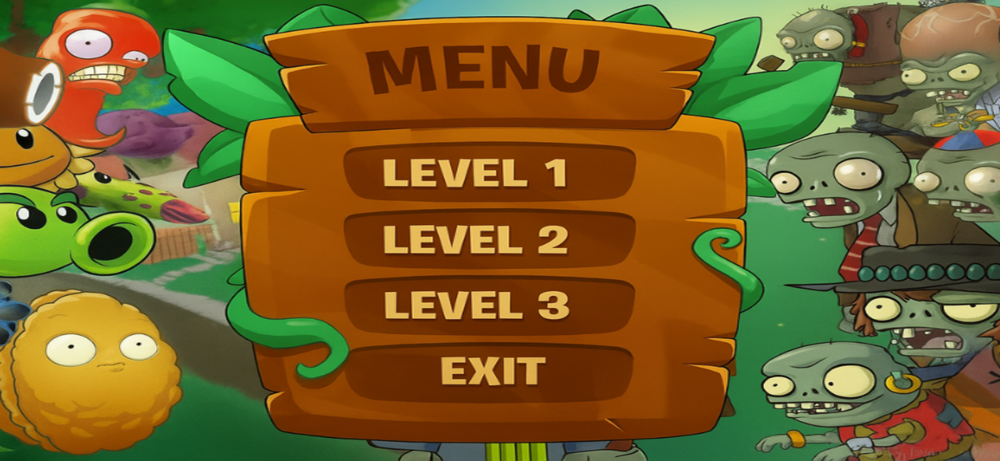
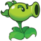
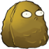
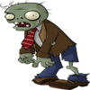
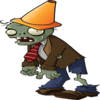
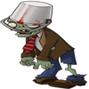
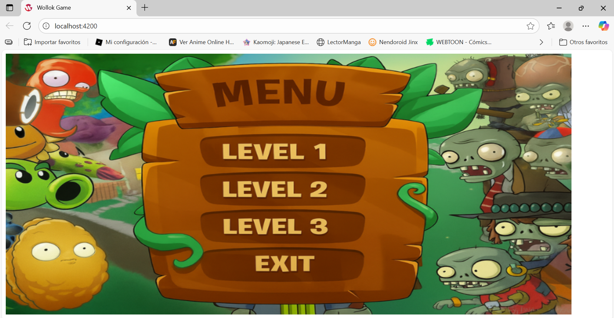

# Plantas vs Zombies
### Universidad Nacional de San Martin - Algoritmos 1

  

Este Plantas vs Zombies es una adaptación del juego original Plantas vs Zombies, en el cual el
jugador debe defender la casa de los distintos zombies atacantes para evitar que lleguen y el juego 
termine. Para proteger la base el jugador tendrá que comprar plantas defensivas y atacantes que
defiendan su jardin.

## Plantas
Cada Planta tiene una función específica, como disparar proyectiles, bloquear el avance de los zombis y generar soles. Las Plantas requieren Dinero para poder ser plantadas, este dinero se genera automáticamente a lo largo de la partida.

  <table>
    <tr>
      <td align="center"> Precio:
      100  Vida: 100 Bloquea el camino</td>
      <td align="center"> Precio: 50 Vida: 40 Genera soles</td>
      <td align="center"> Precio: 100 Vida: 50 Dispara</td>
      <td align="center"> Precio: 75 Vida: 100 Bloquea el camino</td>
    </tr>
  </table>

## Proyectil
Los proyectiles que se utilizan son porotos disparados por el Lanza Guisantes

  <table>
    <tr>
      <td align="center"> Daño: 20</td>
    </tr>
  </table>

## Sol
Los soles que aparecen por pantalla son generados por los girasoles. Suman dinero

  <table>
    <tr>
      <td align="center"> Dinero: 25</td>
    </tr>
  </table>

## Zombies
Los distintos Zombies tienen características propias: más vida o más daño. Atacan en oleadas desde el extremo derecho del tablero e intentan llegar a la casa (extremo izquierdo del tablero).

  <table>
    <tr>
      <td align="center"> Daño: 10 Vida: 80 </td>
      <td align="center"> Daño: 10 Vida: 100 </td>
      <td align="center"> Daño: 10 Vida: 160 </td>
    </tr>
  </table>

## Niveles

**Nivel 1:** Enfrentrar 5 oleadas de zombies.

**Nivel 2:** Enfrentar 7 oleadas de zombies.

**Nivel 3:** Enfrentar 9 oleadas de zombies.

## Controles:

- `1` para elegir nivel 1
- `2` para elegir nivel 2
- `3` para elegir nivel 3
- `4` termina el juego
- `FLECHA ARRIBA` para ir arriba en el mapa
- `FLECHA ABAJO` para ir abajo en el mapa
- `FLECHA IZQUIERDA` para ir a la izquierda en el mapa
- `FLECHA DERECHA` para ir a la derecha en el mapa
- `A` para ir a la izquierda en la tienda
- `D` para ir a la derecha en la tienda
- `ENTER` para poner comprar y colocar planta

## Equipo de desarrollo:

- Carolina Rimini
- Jeremías Zárate
- Ivana Maitena Finke

## Capturas

  
  

  

## Como está hecho

En el archivo nivelesMenu se crea el menu principal, el cual permite elegir los niveles que desea el
usuario.

Se crearon archivos de clases para plantas, zombies y proyectiles; los cuales tienen sus propiedades, métodos e instancias.

Las plantas cuentan con propiedades y métodos como vida, posición, imágen, tipo de planta, si pueden disparar o no, su precio, si pierden vida y si mueren.

Los zombies cuentan con propiedades y métodos como vida, posición, imágen, tipo de zombie, atacar,
tiene un spawn aleatorio en el eje Y del mapa en la esquina derecha, si reciben daño y si mueren. 

Los proyectiles son manejados desde la clase proyectil, la cual cuenta con posición, poder
de proyectil, analiza si colisiono o no con un enemigo.

Los soles son parte de la clase Sol, estos soles son generados por los girasoles.

Las Oleadas de zombies contienen arrays de distintas cantidades de zombies por nivel, los cuales
se van generando a medida que se recorren las oleadas de nivel utilizando funcionalidades de spawn
aleatorio de los zombies.

Las funcionalidades y estados de estas clases son controlados mediante administradores de plantas, zombies, oleadas y proyectiles.

Finalmente todas estas se conectan a un administrador de juego que es el encargado de manejar los
tiempos y acciones de cada proceso ocurrido en el juego y se llama a las funciones implementadas aqui en el archivo juego.wpgm que ejecuta el programa con la tecla "run program".